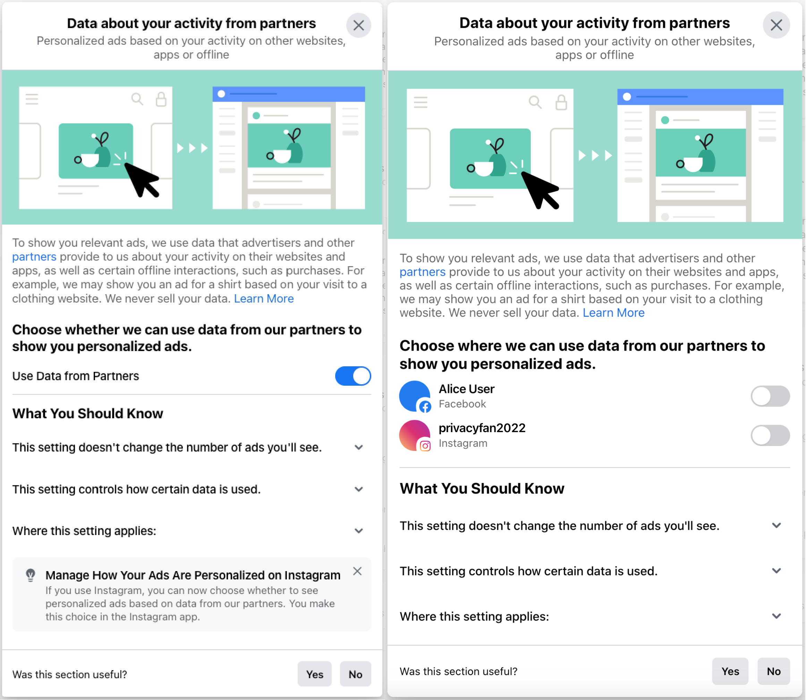
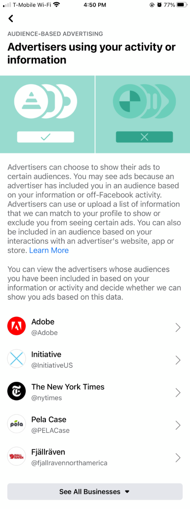
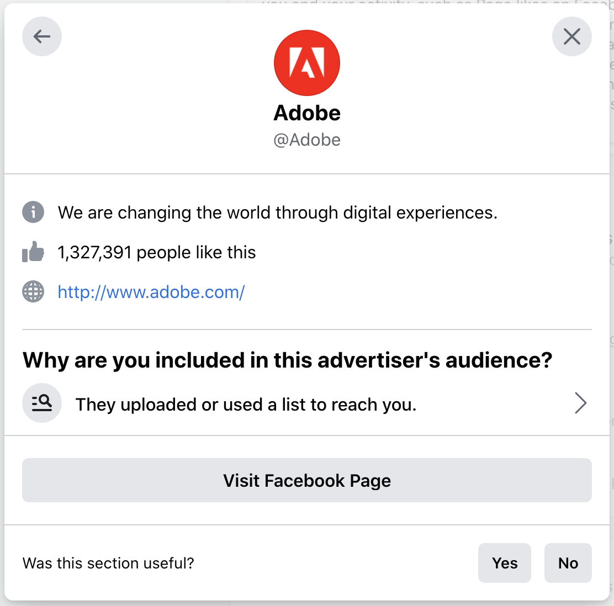
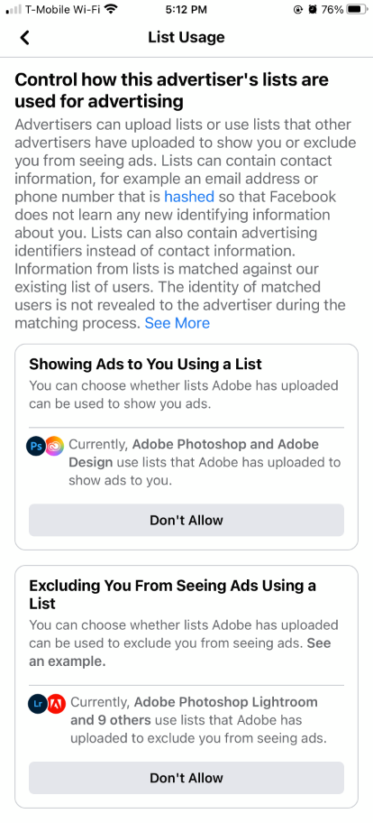
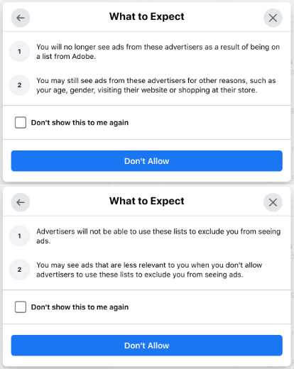

# Ad Settings
Most of the controls in Ad Preferences are found in the Ad Settings section. Ad Settings contains three subsections:

* **Common Questions**, which includes two short descriptions about Facebook's advertising and data practices
* **Manage Data Used To Show You Ads**, which links to the menus for Data About Your Activity From Partners, Categories Used To Reach You, Audience-Based Advertising, and Ads Shown Off Of Facebook.
* **Social Interactions**, which leads to the control to manage whether a user's interactions (e.g. Likes) can be publicly shared alongside ads.

## Common Questions
This subsection contains brief answers to two (at the time of review) questions about Facebook ads. A description of each question is below. More detailed versions of the questions and answers are available in Facebook's help pages [[1](https://www.facebook.com/help/516147308587266/how-ads-work-on-facebook/?helpref=hc_fnav), [2](https://www.facebook.com/help/152637448140583)]. There is also a link to "Learn More" which leads to [a help page about Facebook Ads](https://www.facebook.com/ads/about/?entry_product=ad_preferences_hub).

### Question: What information is used to show me ads?
_"We show you ads based on information we have about you and your activity, such as Page likes on Facebook. We may also use information we have about others and their activity to show you more relevant ads. If personalized ads based on data about your activity from partners are allowed, we can also use data like your activity on websites off of Facebook to decide which ads to show you."_

### Question: Does Facebook sell my data?
_"No, Facebook does not sell data. This includes personal information like your name or the content of your Facebook posts."_

## Data about your activity from partners _(in Manage Data Used To Show You Ads)_  
This option is subtitled "Personalized ads based on your activity from websites, apps or offline." Selecting it will open a page with an illustration, a paragraph of description, one or more switches to toggle on or off Facebook's ability to personalize ads based on data collected from other companies, and additional information at the bottom. A screenshot of the Data from Partners menu in various states is included below.

### Desktop (February 2021)
The "Data about your activity from partners" menu. Left: A Facebook account with the setting switched on (default) and no Instagram account attached. Right: A Facebook account with a linked Instagram account and Data from Partners switched off for both accounts.

### Top description
_"To show you relevant ads, we use data that advertisers and other partners provide to us about your activity on their websites and apps, as well as certain offline interactions, such as purchases. For example, we may show you an ad for a shirt based on your visit to a clothing website. We never sell your data."_ Following the description is a link to "Learn More," which leads to [a help page about adjusting Data From Partners settings](https://www.facebook.com/help/568137493302217).

### Control: Choose [whether/where] we can use data from our partners to show you personalized ads.
This control is either a single switch or (if the user has one or more Instagram accounts connected to their Facebook account) a series of switches. Each switch is turned on by default. Turning off a switch disables ads targeted to that account based on data other companies provide to Facebook such as website activity and purchases (but not including on-Facebook activity or lists.) In this paper, we sometimes refer to this control as "Data from Partners."

### Footer and additional information: What You Should Know
An accordion list at the bottom of the Data from Partners menu describes that toggling the switch(es) will not change the overall amount of ads shown on the relevant platform and only affects the relevance of ads targeted based on data provided to Facebook by outside companies.

## Categories used to reach you _(in Manage Data Used To Show You Ads)_
This option is subtitled "Profile information, interests and other categories used to reach you." Selecting it opens a page with an illustration and two subsections: "Profile Information" and "Interests and Other Categories Used to Reach You."

### Profile Information
Contains a list of switches that toggle on/off targeted ads based on certain types of information supplied in a user's Facebook profile. These types of information may include Employer, Job Title, Education (schools attended), and/or Relationship Status.

### Interests and Other Categories Used to Reach You
This section contains links to two lists of controls, "Interest Categories" and "Other Categories." Interest Categories leads to a list of inferences [3, 4] Facebook has made about a user related to their interests (e.g. _Shoes._) Other Categories leads to a similar list of inferences Facebook has made about a user related to their device usage (e.g. _Owns: iPad Mini 2._)

#### Control: Remove an interest from list
In both lists under Interests and Other Categories Used to Reach You, a user can press a button to Remove any inference from the list. Immediately after the button is pressed, it is replaced with the option to Undo the action; after the user navigates away from the page, the inference disappears completely (Interest Categories) or moves to a separate list of Removed Categories (Other Categories).

## Audience-based advertising _(in Manage Data Used To Show You Ads)_ 
This option is subtitled "Advertisers using your activity or information." Selecting it opens a page with a list of advertisers who have [uploaded a list with PII](https://www.facebook.com/business/news/Custom-Audiences-Is-Now-Available-to-Every-Advertiser) that has been matched to your Facebook account.

### Desktop (February 2021)

 
Selecting an advertiser will bring up a card with a description of the advertiser similar to the Why Am I Seeing This Ad? prompt. The card contains the advertiser's name, profile photo, description (if available), Like count, Facebook Page (if available), and URL (if available.) On the lower half is a header that says "Why are you included in this advertiser's audience?" followed by a link that says "They uploaded or used a list to reach you."

 
Selecting "They uploaded or used a list to reach you" leads to a menu titled "List Usage." From List Usage, users can view which advertisers are using that list to include or exclude them from ads. Selecting the set of advertisers brings up the option to Hide Ads from one or more of the advertisers using the list.

### Control: Don't Allow inclusion/exclusion
The List Usage menu includes options to disallow inclusion and/or exclusion from ads using that list.

### Desktop (February 2021)

 
The first time "Don't Allow" is selected for inclusion or exclusion from lists, a pop-up appears explaining that disabling inclusion/exclusion of ads based on a particular list does not affect ads targeted based on other factors.

 
After proceeding through this menu, the "Don't Allow" button is replaced with an "Allow" button and the set of advertisers using a list for inclusion/exclusion is emptied.

## Ads shown off of Facebook *(in Manage Data Used To Show You Ads)* 
This option is subtitled "Advertisers using your activity or information." Selecting it opens a page with a short description and a switch to allow/deny Facebook from personalizing ads that are displayed outside of Facebook products.

### Control: Disable targeted off-Facebook ads
This control is a switch (turned on and set to "Allowed" by default) with a header that reads "You can decide whether advertisers can choose to reach you through ads off of Facebook based on categories like these, and you can change your choice at any time." The switch can be flipped to "Not Allowed."

## Social Interactions
In this menu, users can choose whether or not they want their Facebook interactions (such as Page Likes) to show up alongside ads in their friends' feeds. The menu contains a short description of the control and an example of an ad with a small "_(User)_ likes _(Advertiser)_" tag at the top.

### Control: Who can see your social interactions alongside ads?
This control is a radio selector with two options, Friends (default) and Only Me. 

###### [3] Emilee Rader. Awareness of Behavioral Tracking and Information Privacy Concern in Facebook and Google. In *Proceedings of the 10th Symposium on Usable Privacy and Security (SOUPS 2014),* page 17, 2014.
###### [4] Emilee Rader, Samantha Hautea, and Anjali Munasinghe."I Have a Narrow Thought Process": Constraints on expla-nations connecting inferences and self-perceptions. In *Sixteenth Symposium on Usable Privacy and Security (SOUPS 2020),* pages 457–488. USENIX Association, August 2020.
