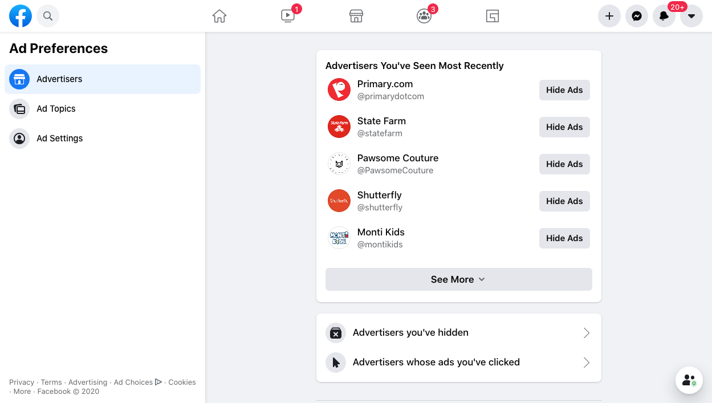

# Advertisers

## Landing page 
The August 2020 update of Ad Preferences removed the main menu. Users are now taken directly to the Advertisers section when they visit Ad Preferences; the rest of the settings can be navigated to using the menu on the left with options for Advertisers, Ad Topics, and Ad Settings. The new Advertisers section contains a list of all the advertisers a user has seen ads for, sorted in reverse chronological order, along with links to view the advertisers they have hidden and the advertisers whose ads they've clicked.

### Desktop (February 2021)

## Control: Hide Ads
Selecting "Hide Ads" for a particular advertiser will hide all ads from that advertiser. The user will not see any ads from that advertiser in the future. When selected, the Hide Ads button is replaced with the option to Undo the action.

## Advertisers you've hidden
Contains a list of all the advertisers a user has hidden with an option to Undo hiding all ads from each. Like the Advertisers You've Seen list on the landing page, Advertisers You've Hidden is sorted in reverse chronological order (based on the time the user hid each advertiser.)

## Advertisers whose ads you've clicked
Contains a reverse-chronologically sorted list of all the advertisers whose ads a user has clicked with the option to Hide (all) Ads from each. If an advertiser's ads have already been hidden, the Hide Ads button is replaced with an option to Undo.
