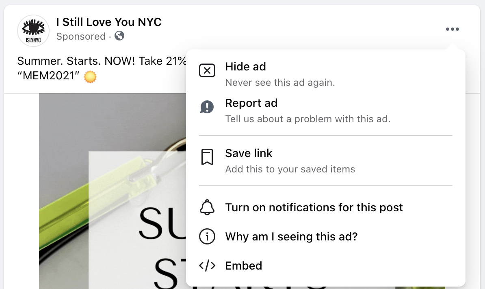
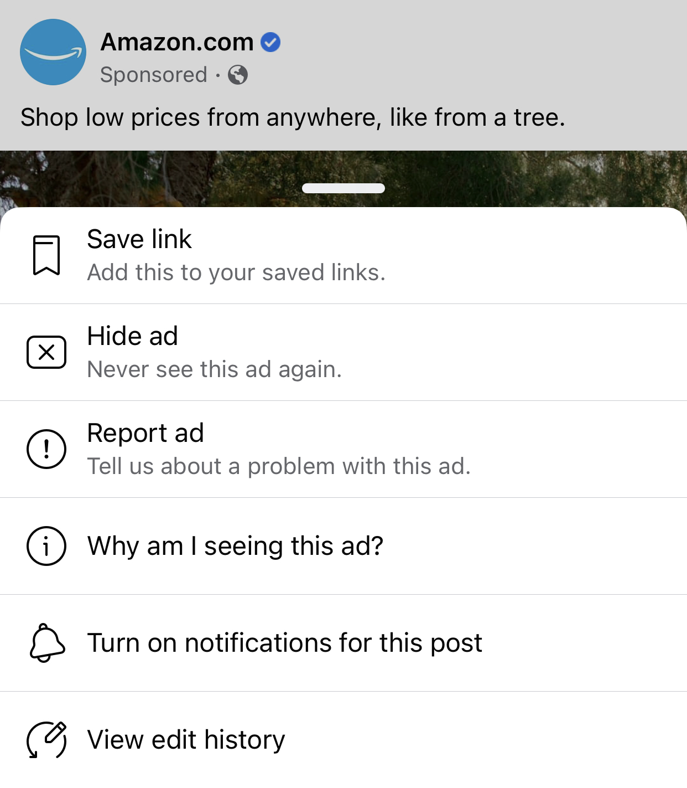

# Contextual ad controls

We refer to controls placed in a menu directly on a particular ad as **contextual controls.** The primary context menu can be accessed by clicking the three dots at the top right of a Facebook ad, and contains these options:

* [Hide Ad](hide-ad.html) ("Never see this ad again")
* [Report Ad](report-ad.html) ("Tell us about a problem with this ad")
* Save post/video/link (depending on ad format)
* Copy link
* Turn on notifications for this post
* [Why am I seeing this ad?](whyamiseeingthisad.html)
* (Desktop) Embed
* (On posts that have been edited) View edit history

We counted Hide Ad, Report Ad, and Why Am I Seeing This Ad? as ad controls. The rest are standard post controls that appear on all sponsored and non-sponsored Facebook posts.

## Primary context menu

### Desktop (May 2021)

### iOS (May 2021)

