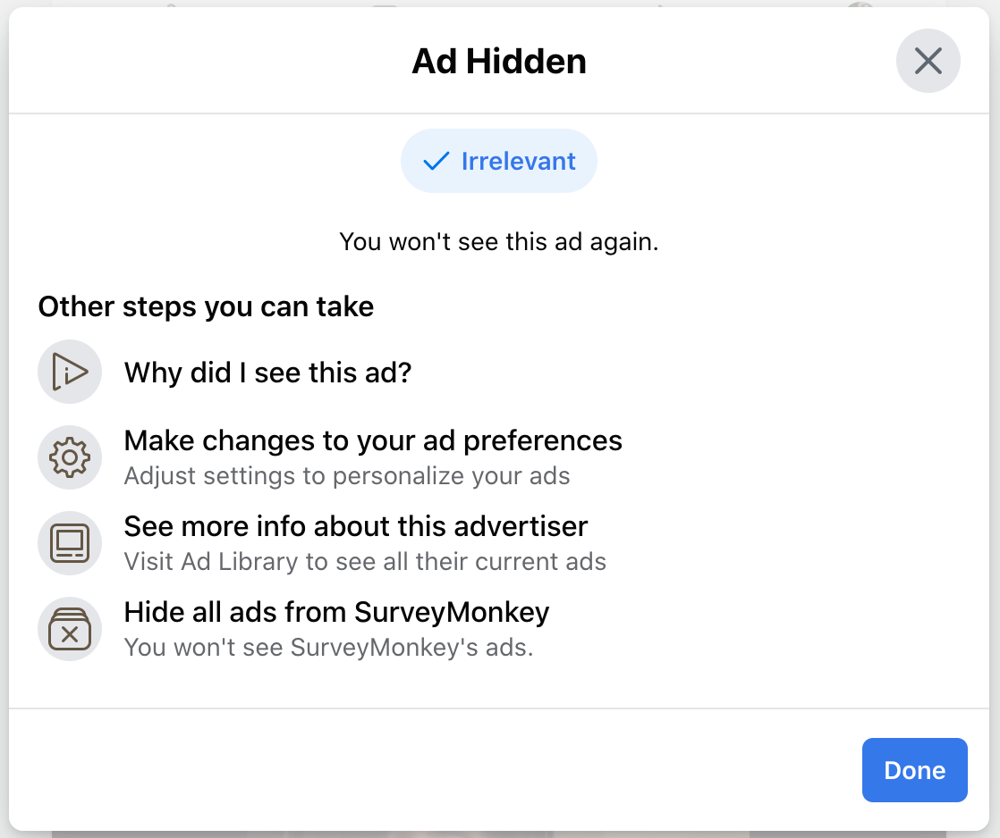

# Hide ad

## Control: Hide ad

Selecting Hide Ad creates a pop-up "Ad Hidden" menu which asks the user to "Please tell us why you hid this ad." The user can select one of these reasons (displayed in a random order): 

* Knows too much
* Repetitive
* Too personal
* Sensitive topic
* Irrelevant
* Already purchased
 
Alternatively, they can close the pop-up without choosing a reason for why they hid the ad. If a reason is selected, the "Ad Hidden" menu brings up a list of other avenues to control ads, such as visiting ad preferences, hiding all ads from that advertiser, viewing the ad in the Ad Library, or opening the Why Am I Seeing This Ad? screen. After closing this window or if a reason is not selected, a small ""Ad Hidden" message will appear in the News Feed in place of the ad with the option to Undo hiding the ad.

# Ad Hidden menu: "Please tell us why you hid this ad"

## Desktop (June 2020)

# Ad Hidden menu 2: More options to control ads

## Desktop (February 2021)

