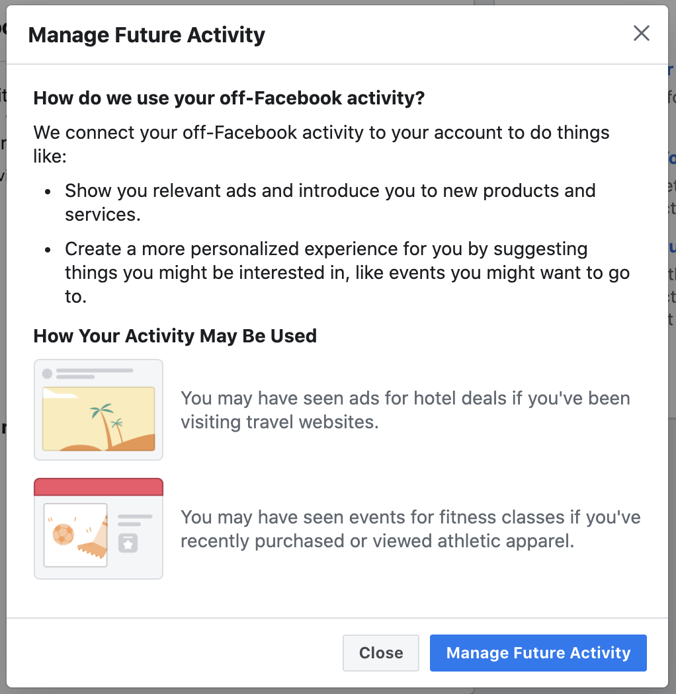
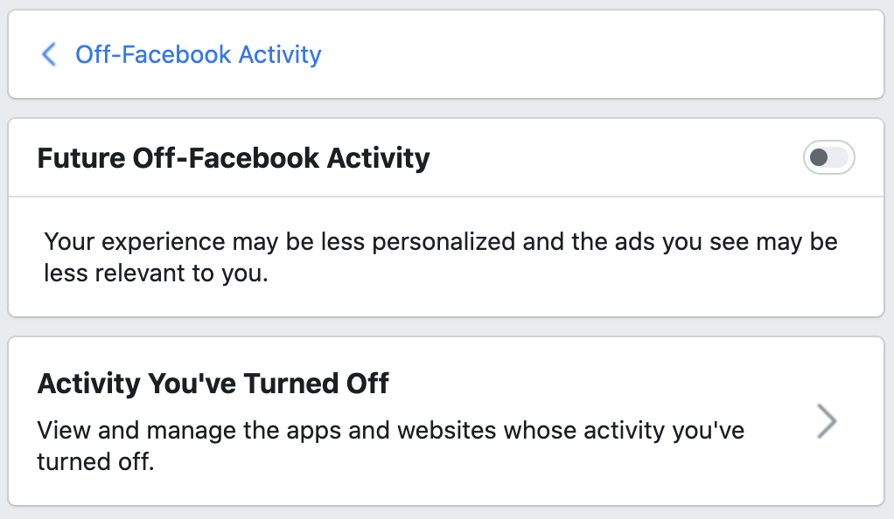

# Manage Your Off-Facebook Activity
This option leads to another page displaying past off-Facebook activity and a small menu with options to Access Your Information, Download Your Information, or Manage Future Activity. Access Your Information and Download Your Information lead to Facebook's options for exporting account data. Selecting Manage Future Activity opens a message describing what off-Facebook activity is used for (below).

### Desktop (February 2021)

 
After proceeding through that message, the user is brought to a menu with a switch to toggle on/off Future Off-Facebook Activity (below) and a link to view any external websites or apps whose activity they have disabled specifically.

## Control: Future Off-Facebook Activity
This is a switch which is enabled by default. Underneath, it explains that turning off Future Off-Facebook Activity prevents ads from being personalized based on activity outside of Facebook, potentially causing ads to be less relevant in the future.

### Desktop (February 2021)

