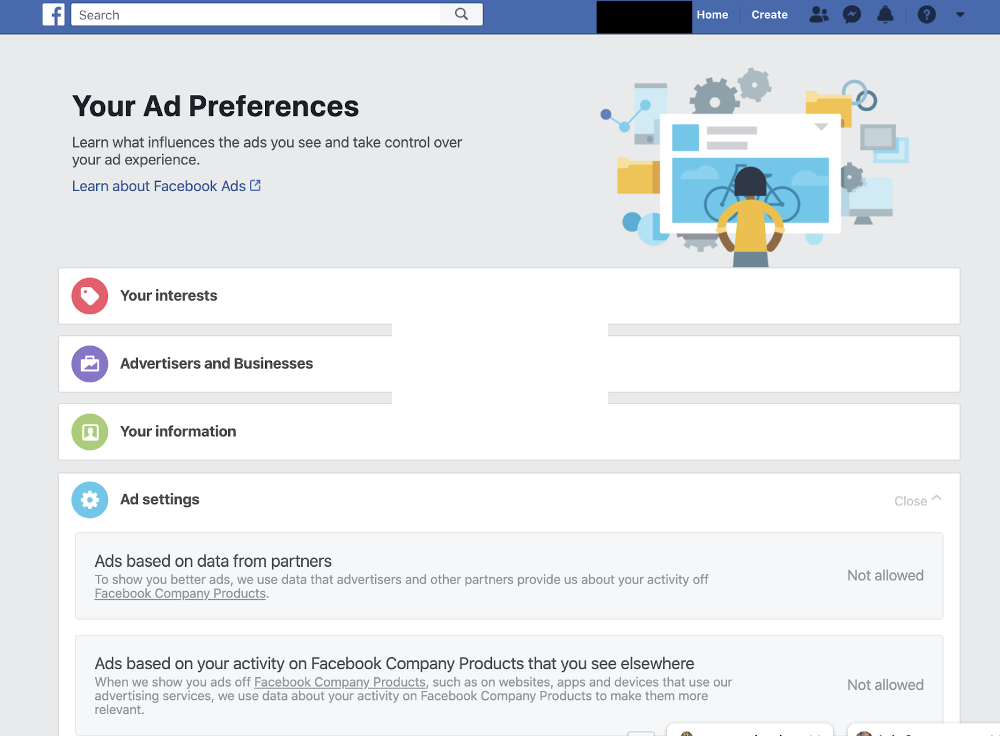
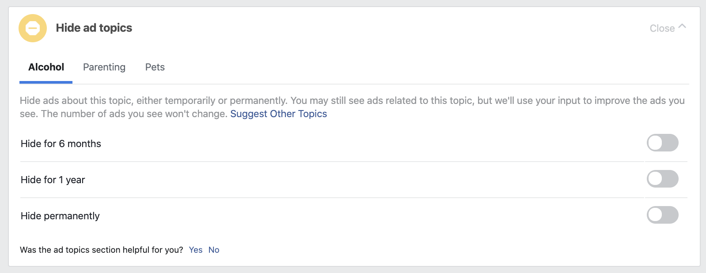

# Your Ad Preferences (prior to August 2020)
The path to get to the Your Ad Preferences page prior to August 2020 was the same as the current path to Ad Preferences.

## Desktop (April 2020)

## Your interests
### Top description
"Interests are determined based on your activity on Facebook, such as your engagement with certain Pages and ads."

### Control: Remove an interest
This control removes a specific interest from the user's profile. Interests are organized by categories, which each have a tab within the section. Upon hovering over a particular interest, Facebook provides a description of why that interest was associated with the user's profile.

## Advertisers and Businesses
### Businesses who uploaded and used a list
Provides a description of advertising lists and how Facebook matches users to uploaded lists. Controls are available through the "View Controls" link below each business.

### Control: Privacy options
Leads to privacy controls or policy policy on the business's website.

### Controls (2): Don't allow inclusion/exclusion  based on lists
Two buttons; one for "Show Ads to You Using a List" and another for "Excluding You From Ads Using a List." These controls open a modal with additional information about how they impact ads on Facebook.

### Control: Hide advertisers using a list to include
Hide all ads from a particular advertiser using the advertising list to show ads to the user.

### Other tabs
Other tabs in this section include: 
* Whose website, app, or store you've interacted with
* Whom you've visited, Whose ads you've clicked
* Whom you've hidden. 
Inside these tabs were lists of advertisers relevant to each tab based on the user's activities.

#### Control: Report *(Business)* to Facebook

#### Control: Hide ads from *(Business)*

## Your Information
### About you
Description: "Some of the ads you see are because advertisers are trying to reach people based on information they've provided on their profile."

### Control: Manage whether we can show you ads...based on these profile fields 
Four toggle switches for relationship status, employer, job title, education. 

## Your categories
### Top description
Explains that users are assigned categories according to their Facebook information and other activity and that these categories are used by advertisers.

### Control: Remove a category
Users can click an `X` on a specific category to remove it from their profile.

## Ad settings
### Control: Ads based on data from partners
Renamed to ["Data about your activity from partners"](adsettings.html#data-about-your-activity-from-partners-in-manage-data-used-to-show-you-ads) in new Ad Preferences.

### Control: Ads based on your activity on Facebook Company Products that you see elsewhere
Renamed to ["Ads shown off of Facebook"](adsettings.html#ads-shown-off-of-facebook-in-manage-data-used-to-show-you-ads) in new Ad Preferences.

### Control: Ads that include your social actions
Renamed to ["Social Interactions"](adsettings.html#social-interactions) in new Ad Preferences.

## Hide ad topics
Three predefined topics (Alcohol, Parenting, and Pets) that users could choose not to see ads about. Renamed to ["Manage Ad Topics"](adtopics.html) in new Ad Preferences.

### Control: Hide for... 
Three toggles for each topic to hide for 6 months, 1 year, or permanently.

### Desktop (April 2020)

