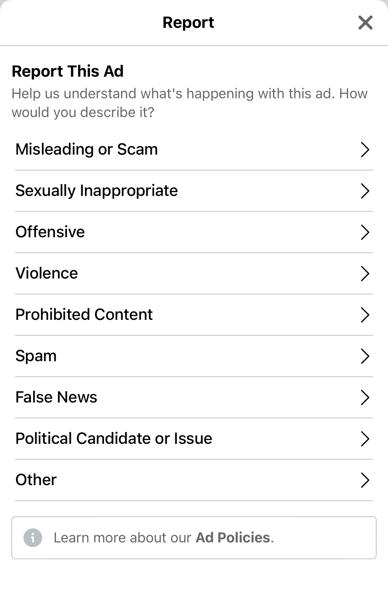

# Report ad

Reporting an ad has generally the same effect as hiding an ad, but reporting is intended for ads that violate Facebook's policies in some way, rather than ads that are simply unpleasant or unwanted.

## Control: Report ad

Choosing to report an ad brings up a menu similar to the Ad Hidden menu, but the reasons displayed are types of ads prohibited by [Facebook's Ad Policies](https://www.facebook.com/policies/ads/):

* Misleading or Scam 
* Sexually Inappropriate
* Offensive
* Violence
* Prohibited Content
* Spam
* False News
* Political Candidate or Issue
* Other 

There is also a link to view Facebook's Ad Policies. The dialogue following submission of a reason to report also contains an extra link: *"I think [this ad] is an unauthorized use of my intellectual property."* After exiting the pop-up menu, the ad is replaced with a small message that says *Ad Reported* and contains the option to *Undo* the report.

# Report Ad menu

## iOS (May 2021)

