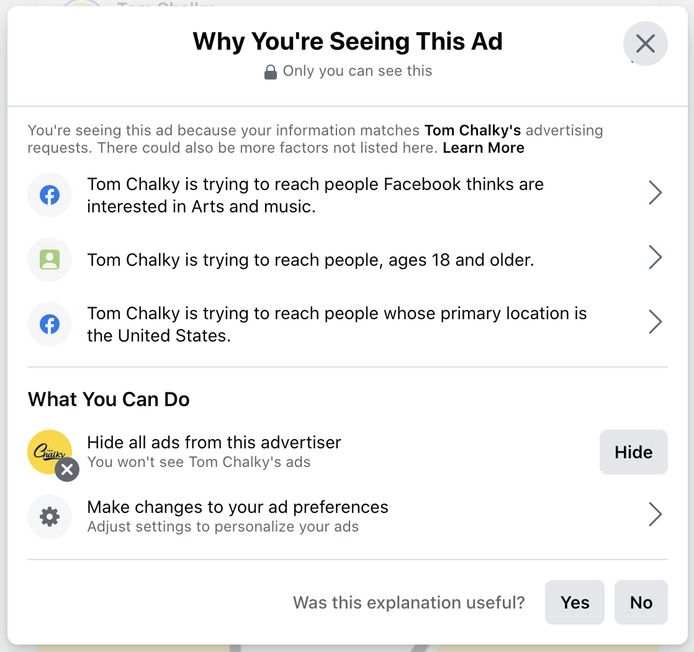

# Why am I seeing this ad?

Selecting "Why am I seeing this ad?" brings up a menu with a bulleted list of reasons why that ad may be appearing in the News Feed. These reasons can include, but are not necessarily limited to:

* **Gender/age:** *(Advertiser)* is trying to reach *(females/males/people),* ages *(age range).*
* **Location:** *(Advertiser)* is trying to reach people whose primary location is *(location).*
* **Lookalike audiences:** *(Advertiser)* is trying to reach people who may be similar to their customers.
* **List audiences:** *(Advertiser)* used a list to reach you.
* **Interest categories:** *(Advertiser)* is trying to reach people Facebook thinks are interested in *(interests).*
* **Facebook activity:** *(Advertiser)* is trying to reach people who *(watched a video from, etc.)* their Facebook Page.
* **Off-Facebook activity:** *(Advertiser)* indicated you may have visited *(their website or app.)*

Selecting a reason in the list will show an extended description about that reason and a related control (e.g. Manage Location Settings for location-based ads.) Related controls may also be available on the main Why Am I Seeing This Ad? page. Some of those controls are listed below.

### Desktop (February 2021)
*An example "Why am I seeing this ad? menu.*

## Control: Hide all ads from this advertiser
The option to Hide Ads from the advertiser appears in the Why Am I Seeing This Ad? menu regardless of the reason(s) Facebook provides for why that ad appeared.

## Control: Don't allow ads using *(List Provider)*'s lists
This control appears if the ad was targeted using a list.

## Control: Control data from partners
This control appears if the ad was targeted using off-Facebook activity.

## Control: Manage Your Off-Facebook Activity
This control appears if the ad was targeted using off-Facebook activity.

## Control: Make changes to your Ad Preferences
This control appears if the ad was not targeted using a list or off-Facebook Activity.
